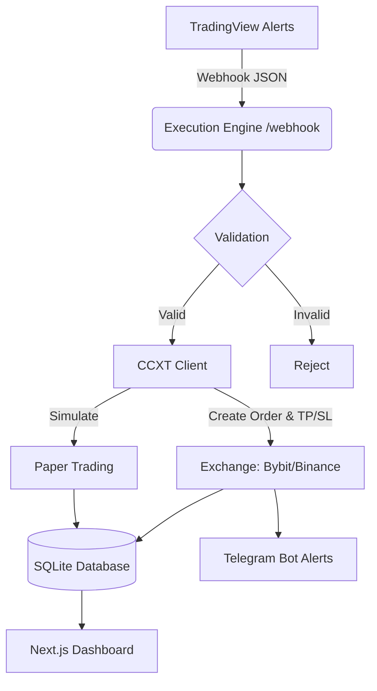

# Trading Automation System - Technical Documentation

> **Status:** Active / Living Document
> **Last Updated:** June 2026

## 1. Project Overview
This project is a high-performance, automated cryptocurrency trading system. It acts as an intermediary between signal providers (like **TradingView**) and cryptocurrency exchanges (like **Bybit** and **Binance**), allowing users to execute trades fully automatically based on custom strategies, complete with risk management (Take Profit / Stop Loss) and portfolio tracking.

## 2. Architecture & Tech Stack

The project is structured as a **Monorepo** (using Turborepo) to share configurations and database schemas across applications.

### 2.1 Tech Stack
- **Frontend (`apps/web`)**: Next.js 14 (App Router), React, Tailwind CSS, shadcn/ui components.
- **Backend/Engine (`apps/engine`)**: Node.js, Express.js, TypeScript.
- **Exchange Integration**: CCXT (Universal Cryptocurrency Exchange Trading API).
- **Database (`packages/database`)**: SQLite (via `@libsql/client`) with Drizzle ORM.
- **Notifications**: Telegraf (Telegram Bot API).

### 2.2 System Flow

## 3. Core Modules & Functionalities

### 3.1 Web Dashboard (Frontend)
The frontend serves as the control center for the user.
- **API Keys Management**: Users can add exchange API keys. Keys are encrypted before being stored in the database.
- **Bot Configuration**: Users can create multiple bots. Each bot specifies:
  - Pair (e.g., BTC/USDT)
  - Market Type (Spot / Futures)
  - Order Type (Market / Limit)
  - Trade Size (Fixed USDT amount or % of available balance)
  - Leverage (For Futures)
  - Stop Loss (%) & Take Profit (%)
  - Paper Trading Mode (Toggle)
  - Cooldown (Debounce timer to prevent duplicate signals)
- **Settings**: Global configurations like TradingView Webhook Secret, Telegram Bot Token, and Chat ID.
- **Trading Activity**: A real-time data table displaying the history of all executed trades, current statuses (Open/Closed), and realized PnL. Includes manual actions like deleting records or exporting them to a Journaling App (e.g., PortaIQ).

### 3.2 Execution Engine (Backend)
The engine runs continuously and listens for incoming webhooks on port 4000.
- **Webhook Endpoint (`/webhook`)**: Receives payload `{ secret, botId, side, amount, price }`.
- **Security & Cooldowns**: Validates the incoming secret against the user's database settings. Checks the bot's cooldown timer to reject rapid, duplicate signals.
- **Position Sizing**: Dynamically calculates the exact crypto amount to buy/sell based on real-time exchange prices and the user's wallet balance (if % sizing is used).
- **Conditional Orders**: Immediately after a successful entry order, the engine dispatches `stop_market` and `take_profit_market` conditional orders to the exchange to guarantee risk management.

### 3.3 Exchange Synchronization (The Sync Worker)
Since conditional orders (TP/SL) are executed by the exchange in the background, the engine features a synchronization mechanism:
- **Periodic Polling**: A `setInterval` loop runs every 10 minutes.
- **Status Check**: It queries the exchange for the status of specific `tpOrderId` and `slOrderId` associated with open trades.
- **PnL Calculation**: If an order is found to be `closed`, the worker calculates the Realized PnL (accounting for Long or Short directions), updates the trade status to `Closed`, and fires an asynchronous Telegram alert.
- **Manual Sync**: An `/api/sync` endpoint allows the frontend to trigger this process on-demand via the "Force Sync" button.

### 3.4 Notifications (Telegram)
Integrated via `telegraf`. The bot dispatches HTML-formatted alerts directly to the user's phone for:
- Trade Entries (Live and Paper Trading)
- Take Profit / Stop Loss Hits (Triggered by the Sync Worker)

## 4. Database Schema Overview

- **`users`**: Stores Webhook secrets, Telegram credentials, and domain configs.
- **`apiKeys`**: Stores encrypted API Keys and Secrets tied to specific exchanges.
- **`bots`**: Stores all trading parameters, risk settings, and cooldown timestamps.
- **`trades`**: The transaction ledger. Stores symbol, side, price, amount, `status` (open/closed), `pnl`, and the native exchange order IDs (`exchangeOrderId`, `tpOrderId`, `slOrderId`).

## 5. Future Roadmap & Extensibility
As this is a living document, the following features are mapped for future iterations:
- **PortaIQ Integration**: Fully implement the mocked API call in `actions/trades.ts` to export trades automatically to the journaling system.
- **WebSocket User Data Streams**: Upgrade the Periodic Polling sync worker to a real-time WebSocket connection for instant PnL tracking without API rate limits.
- **Multi-User Support**: Add authentication (e.g., NextAuth/Clerk) to transition the system from a single-user architecture to a multi-tenant SaaS.

---
*Note: Whenever a new major feature is added or the architectural flow changes, this document must be updated to reflect the current state of the application.*
